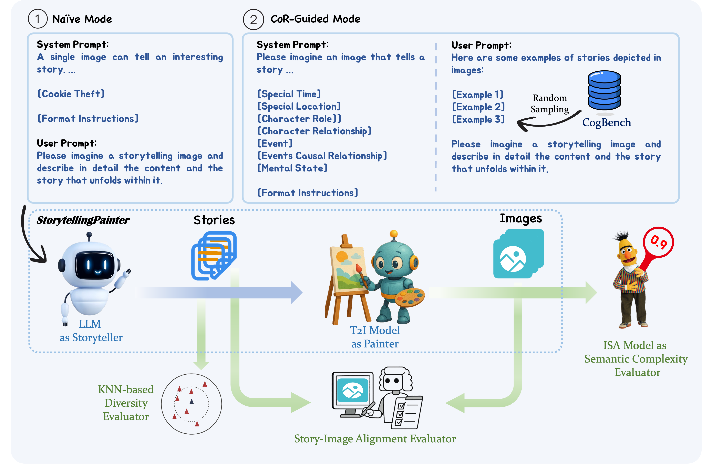

# Generating Storytelling Images with Rich Chains-of-Reasoning

> Note: This repository is still under construction.

## Abstract

An image can convey a compelling story by presenting rich, logically connected visual clues. These connections form Chains-of-Reasoning (CoRs) within the image, enabling viewers to infer events, causal relationships, and other information, thereby understanding the underlying story. In this paper, we focus on these semantically rich images and define them as Storytelling Images. Such images have diverse applications beyond illustration creation and cognitive screening, leveraging their ability to convey multi-layered information visually and inspire active interpretation. However, due to their complex semantic nature, Storytelling Images are inherently challenging to create, and thus remain relatively scarce. To address this challenge, we introduce the Storytelling Image Generation task, which explores how generative AI models can be leveraged to create such images. Specifically, we propose a two-stage pipeline, StorytellingPainter, which combines the creative reasoning abilities of Large Language Models (LLMs) with the visual synthesis capabilities of Text-to-Image (T2I) models to generate Storytelling Images. Alongside this pipeline, we develop a dedicated evaluation framework comprising three main evaluators: a Semantic Complexity Evaluator, a KNN-based Diversity Evaluator and a Story-Image Alignment Evaluator. Given the critical role of story generation in the Storytelling Image Generation task and the performance disparity between open-source and proprietary LLMs, we further explore tailored training strategies to reduce this gap, resulting in a series of lightweight yet effective models named Mini-Storytellers. Experimental results demonstrate the feasibility and effectiveness of our approaches. 

## StorytellingPainter Pipeline

{width=80%}

Use the following command to generate 100 stories and their corresponding images in the CoR-Guided mode, with GPT-4o as the Storyteller model and GPT-Image-1 as the Painter model.

```python
python storytellingpainter_pipeline.py \
    --llm_name="gpt-4o" \
    --story_gen_mode="cor_guided" \
    --img_gen_model_name="gpt-image-1" \
    --N=100 \
    --output_dir="path/to/output_dir" \
    --function="story_img_gen" \
    --story_pool_name="cogbench_test" \
    --llm_temperature=1.0
```
